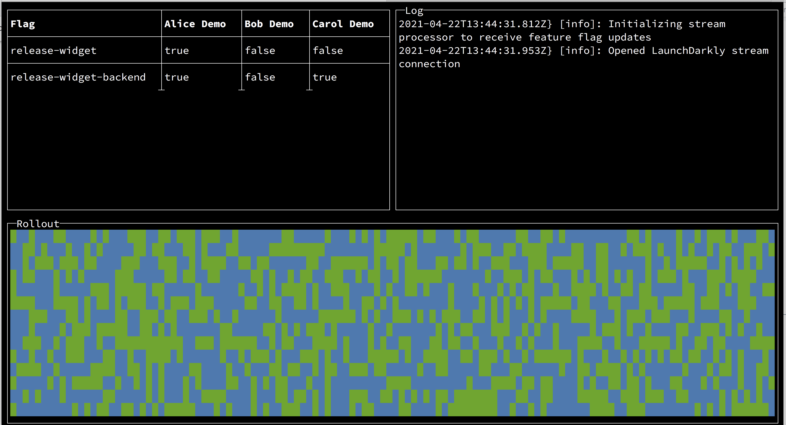

# flag-term-demo




- Creates 1920 fake users using faker
- Allows you to add custom users from users.json
- Displays the flag evaluations for custom users in a table
- Show logs from the launchdarkly SDK
- Automatically refreshes when rules or users.json change
- Evaluates a flag called `release-widget` for all custom+generated users
	- Evaluation results are displayed in a grid where the cell is either green (true) or blue (false)

You can demonstrate the determinism of rollouts by:

- Rolling out to 20% of users
- Rolling out to 50% of users
- Roll back to 20% of users
- Note that the grid looks the same at 20% each time

Tested on node v16

## Setup

```
npm install 
```

## Usage

```
export LD_SDK_KEY=sdk-abc-123
node .
```

## Controlling the UI

This demo is controlled by feature flags. The flags can be created using the launchdarkly terraform provider:

```
resource "launchdarkly_feature_flag" "release_widget" {
    project_key = launchdarkly_project.term.key
    key = "release-widget"
    name = "Release: Widget"
    description = "Controls availabiity of the Widget component. Requires backend API"
    variation_type = "boolean"
    tags = ["early-access-program","managed-by-product-team", "managed-by-frontend-team"]
    temporary = true
    
    variations {
            name = "Available"
            value = true
            description = "Widget is available to users"
        }
    variations {
            name = "Unavailable"
            value = false
            description = "Widget is unavailable "
        }
    
  include_in_snippet = true
  default_on_variation = true
  default_off_variation = false
}

  

resource "launchdarkly_feature_flag" "release_widget_backend" {
    project_key = launchdarkly_project.term.key
    key = "release-widget-backend"
    name = "Release: Widget Backend"
    description = "Controls availability of the Widget Backend APIs. Incident Response Runbook: <https://example.com>"
    variation_type = "boolean"
    tags = ["managed-by-backend-team", "incident-response"]
    temporary = true
    variations {
            name = "Available"
            value = true
            description = "Widget API is available to serve requests"
        }
    variations {
            name = "Unavailable"
            value = false
            description = "Widget API is unavailable. Requests will return 503"
        }
    
  include_in_snippet = true
  default_on_variation = true
  default_off_variation = false
}
  

resource "launchdarkly_feature_flag" "config_log_verbosity" {
    project_key = launchdarkly_project.term.key
    key = "config-log-verbosity"
    name = "Config: Log Verbosity"
    description = "Controls the log verbosity of applications. Logs are aggregated in $service <http://example.com/logs>"
    variation_type = "number"
    tags = ["incident-response"]
    temporary = false
    variations {
            name = "Emergency"
            value = 0
            description = "System is unusable"
        }
    variations {
            name = "Alert"
            value = 1
            description = "Action must be taken immediately. A condition that should be corrected immediately, such as a corrupted system database."
        }
    variations {
            name = "Critical"
            value = 2
            description = "Critical conditions"
        }
    variations {
            name = "Error"
            value = 3
            description = "Error conditions"
        }
    variations {
            name = "Warning"
            value = 4
            description = "Warning conditions"
        }
    variations {
            name = "Notice"
            value = 5
            description = "Normal but significant conditions\t. Conditions that are not error conditions, but that may require special handling."
        }
    variations {
            name = "Info"
            value = 6
            description = "Informational messages"
        }
    variations {
            name = "Debug"
            value = 7
            description = "Messages that contain information normally of use only when debugging a program."
        }
    
  include_in_snippet = true
  default_on_variation = 3
  default_off_variation = 3
}
  

resource "launchdarkly_feature_flag" "allow_eap_widget" {
    project_key = launchdarkly_project.term.key
    key = "allow-eap-widget"
    name = "Allow: Early Access Program : Widget"
    description = "Allows Users to view and opt-in to the Widget Early Access Program"
    variation_type = "boolean"
    tags = []
    temporary = true
    variations {
            name = "Allow Opt-In"
            value = true
            description = "User will be able to see and opt in to this early access program. "
        }
    variations {
            name = "Deny Opt-In"
            value = false
            description = "User will be unable to opt-in to this early program. Users who are not already opted-in will be not see the access program."
        }
    
  include_in_snippet = true
  default_on_variation = true
  default_off_variation = false
}
  

  

resource "launchdarkly_feature_flag" "config_table_cell_color" {
    project_key = launchdarkly_project.term.key
    key = "config-table-cell-color"
    name = "Config: Table Cell Color"
    description = "Controls the color of the cells in the Rollout Display Table"
    variation_type = "string"
    tags = ["managed-by-presenter", "user-interface", "rollout-table"]
    temporary = false
    variations {
            name = "Green"
            value = "green"
            description = ""
        }
    variations {
            name = "Blue"
            value = "blue"
            description = ""
        }
    variations {
            name = "Red"
            value = "red"
            description = ""
        }
    variations {
            name = "Cyan"
            value = "cyan"
            description = ""
        }
    variations {
            name = "Yellow"
            value = "yellow"
            description = ""
        }
    variations {
            name = "Magenta"
            value = "magenta"
            description = ""
        }
    variations {
            name = "Black"
            value = "black"
            description = ""
        }
    
  include_in_snippet = true
  default_on_variation = "red"
  default_off_variation = "red"
}
  

resource "launchdarkly_feature_flag" "config_table_cell_symbol" {
    project_key = launchdarkly_project.term.key
    key = "config-table-cell-symbol"
    name = "Config: Table Cell Symbol"
    description = "Controls the symbol used in the Rollout Display table. Must be one character, preferably mono-width."
    variation_type = "string"
    tags = ["managed-by-presenter", "user-interface", "rollout-table"]
    temporary = false
    variations {
            name = "Block"
            value = "█"
            description = ""
        }
    variations {
            name = "Happy"
            value = "🙂"
            description = ""
        }
    variations {
            name = "Sad"
            value = "🙁"
            description = ""
        }
    variations {
            name = "Sssh!"
            value = "🤫"
            description = ""
        }
    variations {
            name = "Party"
            value = "🎉"
            description = ""
        }
    
  include_in_snippet = true
  default_on_variation = "█"
  default_off_variation = "█"
}
  

resource "launchdarkly_feature_flag" "db_create_table_widget" {
    project_key = launchdarkly_project.term.key
    key = "db-create-table-widget"
    name = "DB: Create Table: Widget"
    description = "Serves true after the schema change is applied and the table is available for use "
    variation_type = "boolean"
    tags = ["managed-by-dba"]
    temporary = true
    variations {
            name = "Table Available"
            value = true
            description = "Table has been created and is ready for use in this environment"
        }
    variations {
            name = "Table Unavailable"
            value = false
            description = "Table is unavailable"
        }
    
  include_in_snippet = false
  default_on_variation = true
  default_off_variation = false
}
  

resource "launchdarkly_feature_flag" "show_table_row" {
    project_key = launchdarkly_project.term.key
    key = "show-table-row"
    name = "Show: Table Row"
    description = "Controls which table rows are displayed in the demo"
    variation_type = "boolean"
    tags = ["managed-by-presenter", "user-interface", "rollout-table"]
    temporary = false
    variations {
            name = "Show"
            value = true
            description = "Row will be shown"
        }
    variations {
            name = "Hide"
            value = false
            description = "Row will be hidden"
        }
    
  include_in_snippet = true
  default_on_variation = true
  default_off_variation = false
}
  
resource "launchdarkly_feature_flag" "show_table_row" {
    for_each = launchdarkly_feature_flag.*.
    project_key = launchdarkly_project.term.key
    key = "show-table-row"
    name = "Show: Table Row"
    description = "Controls which table rows are displayed in the demo"
    variation_type = "boolean"
    tags = ["managed-by-presenter", "user-interface", "rollout-table"]
    temporary = false
    variations {
            name = "Show"
            value = true
            description = "Row will be shown"
        }
    variations {
            name = "Hide"
            value = false
            description = "Row will be hidden"
        }
    
  include_in_snippet = true
  default_on_variation = true
  default_off_variation = false
}

resource "launchdarkly_feature_flag" "config_rollout_flag" {
    project_key = launchdarkly_project.term.key
    key = "config-rollout-flag"
    name = "Config: Rollout Flag"
    description = "Sets the flag displayed in the Rollout Table. Docs: <https://example.com/rollout-display-table#config-rollout-flag>"
    variation_type = "string"
    tags = ["managed-by-presenter", "user-interface", "rollout-table"]
    temporary = false

    variations {
            name = "Release: Widget"
            value = "release-widget"
            description = ""
    }

    variations {
            name = "Release: Widget Backend"
            value = "release-widget-backend"
            description = ""
    }
     
  include_in_snippet = true
  default_on_variation = "release-widget"
  default_off_variation = "release-widget"
}
```